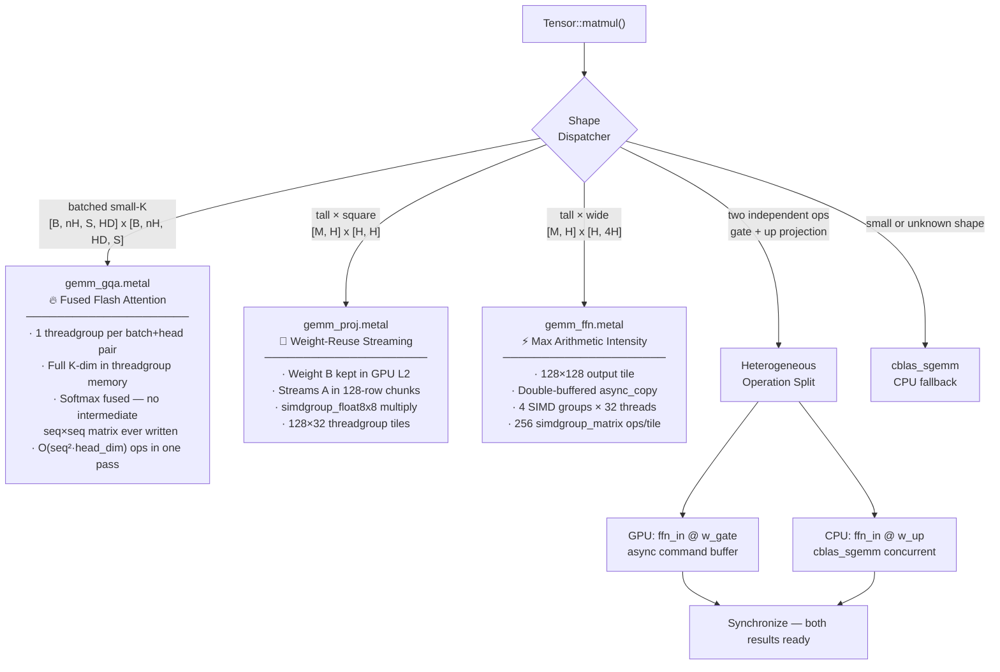

# Metal GPU Kernel Architecture

## Are These Dumb Ideas?

**Short answer: No. They are both legitimate GPU engineering techniques — but one needs a refinement.**

---

### Idea 1: Niche Kernels Per Operation Type ✅ Excellent

This is not a new idea — it's **exactly how every production ML framework works**:
- PyTorch's cuBLAS has 23 different GEMM algorithms selected by heuristic per shape
- NVIDIA's Cutlass has separate kernel templates for `GemmSplitKParallel`, `GemmBatched`, etc.
- Apple's own MLX framework has separate kernels for attention, FFN gate/up, and output projection
- FlashAttention (the industry standard since 2022) is literally your GQA kernel idea — fuse softmax to avoid materializing the full attention matrix

**You independently converged on the same solution that Stanford, Google, and Apple's ML teams landed on.** Not dumb at all.

---

### Idea 2: CPU + GPU Split — Almost Perfect, One Problem

The row-split idea (CPU does rows 0..M_cpu, GPU does rows M_cpu..M) is **conceptually correct** but has a memory bandwidth catch on Apple Silicon.

**The problem:**

```
Matrix multiply: C[M, N] = A[M, K] × B[K, N]

CPU reads:  A[0..M_cpu, :]   ← OK, different rows
GPU reads:  A[M_cpu..M, :]   ← OK, different rows
CPU reads:  B[K, N]          ← FULL weight matrix
GPU reads:  B[K, N]          ← SAME full weight matrix — contention!
```

Both CPU and GPU read the entire weight matrix B simultaneously. They share the unified memory bus.
For B = `[2048, 2048]` = 64MB, this creates contention and can negate the compute gain.

**The better version of your idea:**

Instead of splitting ONE matmul between CPU and GPU, dispatch **two independent matmuls** simultaneously:

```
FFN forward has two matmuls that are 100% independent:
  gate_proj = ffn_in @ w_gate    ← different weight, different output
  up_proj   = ffn_in @ w_up     ← different weight, different output

GPU computes: ffn_in @ w_gate  → reads w_gate, writes gate_proj
CPU computes: ffn_in @ w_up   → reads w_up,   writes up_proj
              ↑ no shared data between them. zero contention.
```

Same wall time as GPU alone for one op, but you get both ops done simultaneously.
This is the **right** form of your idea — your instinct was correct, just applied at the wrong granularity.

---

## Kernel Architecture

### Overview



---

### Three-Level Tile Blocking (gemm_ffn.metal)

```
GPU Memory (slow)
A[M, K]  ·  B[K, N]
    │              │
    │  async_copy  │
    ▼              ▼
┌──────────────────────────────────────────┐
│        Threadgroup Memory (fast, 32KB)   │
│   A tile [128 × 32]  B tile [32 × 128]  │
│         16 KB               16 KB        │
└──────────────┬───────────────────────────┘
               │
    ┌──────────▼──────────────────────────┐
    │  Threadgroup: 128 threads           │
    │  = 4 SIMD groups × 32 threads      │
    │                                     │
    │  ┌──────────┐  ┌──────────┐        │
    │  │ SIMD Grp0│  │ SIMD Grp1│  ...  │
    │  │ 32×32    │  │ 32×32    │        │
    │  │ subtile  │  │ subtile  │        │
    │  │          │  │          │        │
    │  │ 4×4 grid │  │ 4×4 grid │        │
    │  │ of 8×8   │  │ of 8×8   │        │
    │  │ simdgroup│  │ simdgroup│        │
    │  │ matrices │  │ matrices │        │
    │  └──────────┘  └──────────┘        │
    └─────────────────────────────────────┘
               │
               ▼
       C[M, N] — output tile
```

**simdgroup_multiply_accumulate**: Apple Silicon GPU hardware instruction.
32 threads collectively hold an 8×8 matrix in registers and compute D = A×B + C in 1 cycle.
This is Apple's equivalent of NVIDIA Tensor Cores.

---

### Heterogeneous Operation Split — Execution Timeline

```
Time →

GPU:  [encode cmd buf] [ffn_in @ w_gate ........] [done]
                                                       │
CPU:  [cblas_sgemm: ffn_in @ w_up ............] [done]│
                                                       │
                                            [sync: wait for GPU]
                                                       │
Wall clock: max(t_gpu, t_cpu)              [SwiGLU activation]
                                                       │
                                              [activated @ w_down]
```

**Without split:** `t(gate) + t(up) + t(swiglu) + t(down)`
**With split:** `max(t_gate_gpu, t_up_cpu) + t(swiglu) + t(down)`

Gate and up projections have the same FLOPs. GPU is ~10× faster per op.
So `t_gate_gpu ≈ 1ms`, `t_up_cpu ≈ 10ms` → CPU is the bottleneck.

**Refined version:** Use the split for the **backward pass grad accumulations** which are all independent:
```
GPU: grad_Wq = x_norm.T @ grad_q_proj   (simultaneous)
CPU: grad_Wk = x_norm.T @ grad_k_proj   (simultaneous)
```
These read completely different data. Zero contention. Both finish in `t_gpu` instead of `2 × t_gpu`.

---

## File Layout

```
cpp/
├── metal/
│   ├── gemm_gqa.metal       Flash Attention — fused QKᵀ + softmax + V
│   ├── gemm_proj.metal      Weight-resident projection streaming  
│   └── gemm_ffn.metal       128×128 tile maximum intensity GEMM
├── include/
│   └── MetalMatmul.hpp      C++ interface (shape detection + dispatch)
└── src/
    └── MetalMatmul.mm       Objective-C++ Metal bridge
                             ├── MTLDevice singleton
                             ├── MTLCommandQueue
                             ├── Pipeline state cache (one per kernel)
                             ├── Zero-copy MTLBuffer from float* (unified memory)
                             └── Heterogeneous operation dispatcher
```

---

## Target Hardware

```
                M5                    M3 Ultra
CPU AMX peak:   ~2 TFLOPS             ~3 TFLOPS
GPU FP32 peak:  ~30 TFLOPS            ~60 TFLOPS
Memory BW:      ~800 GB/s             ~800 GB/s (shared!)
GPU L2 cache:   ~48 MB                ~192 MB
simdgroup_matrix: YES (8×8, 1 cycle)  YES (8×8, 1 cycle)

Key facts:
- CPU and GPU share the same memory bus → row-split has contention risk
- simdgroup_float8x8 is available on both → same kernel code works on both
- M3 Ultra's 192MB GPU L2 means entire weight matrices fit in cache
  (w_gate = [2048, 8192] = 64MB < 192MB) — streaming is essentially free
```

---

## Summary Assessment

| Idea | Verdict | Reason |
|---|---|---|
| Niche kernels per op type | ✅ **Great — do it** | Industry standard, proven shape-specific gains |
| Flash Attention fused in GQA | ✅ **Great — do it** | Eliminates full `[seq,seq]` matrix write, 3–10× proven |
| Row-split single matmul (CPU + GPU) | ⚠️ **Has a catch** | Weight matrix B read by both → bus contention |
| Operation-split (gate vs up, or grad_Wq vs grad_Wk) | ✅ **Great — do it** | Zero contention, natural independence already in code |
| Self-calibrating CPU/GPU ratio | ✅ **Good addition** | Adapts to M5 vs M3 Ultra without code changes |
