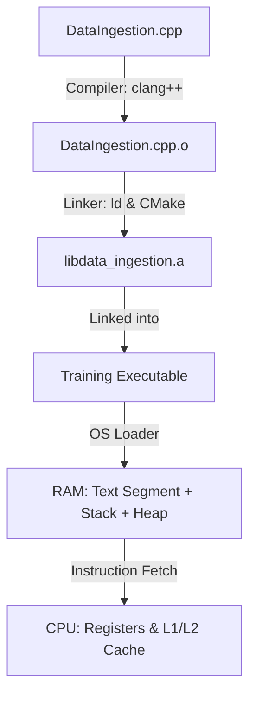
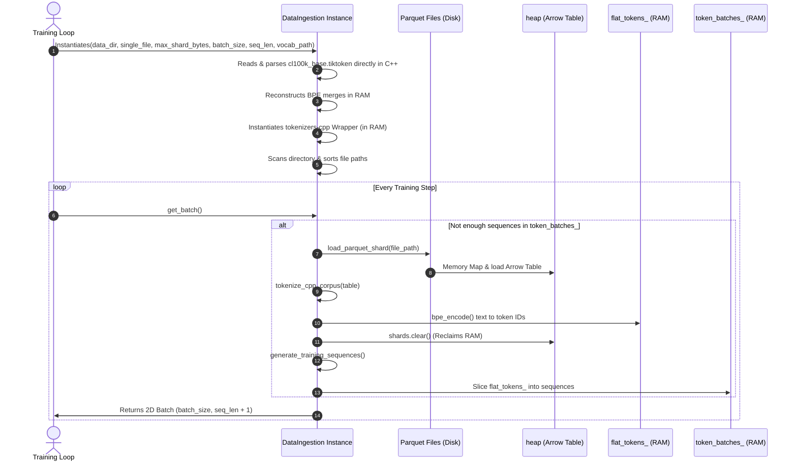

# CPU Execution & Memory Blueprint: `DataIngestion`

This document provides a low-level, systems-engineering breakdown of the `DataIngestion` class. It explains how C++ code is compiled, loaded into memory, and executed by the CPU, followed by a step-by-step memory and execution blueprint for each method in the pipeline.

The pipeline is designed to ingest code dataset shards (specifically The Stack v1 C++ data in Parquet format, downloaded via `python/scripts/download_cpp_blobs.py` to obtain the actual raw code content instead of symlink blobs) and perform local model training.

---

## ⚙️ Part 1: Compilation to CPU Execution

Before any code runs, your C++ source code undergoes a transformation to become machine instructions that the CPU can execute.



### 1. Compilation (Source Code to Machine Code)
When you run `cmake --build build`, the compiler (`clang++`) processes `DataIngestion.cpp`:
* **Syntax & Type Checks:** Verifies that class definitions and methods match the declarations in `DataIngestion.hpp`.
* **Translation:** Translates C++ statements into target-specific **Assembly/Machine Instructions** (ARM64 assembly for Apple Silicon).
* **Object File:** Emits `DataIngestion.cpp.o`, containing raw binary instructions and a symbol table.

### 2. Linking
The linker collects your object files and external libraries (like Apache Arrow: `libarrow.2400.dylib`):
* It resolves external symbols (like `arrow::io::ReadableFile::Open`).
* It packages your code into a static library `libdata_ingestion.a` or a final training executable binary.

### 3. OS Loading (Running the Program)
When you start the training executable, the macOS kernel loader:
1. **Allocates Memory:** Maps virtual memory space for the process.
2. **Text Segment (Instructions):** Loads the compiled machine instructions of `DataIngestion` methods into read-only memory.
3. **Initializes the Stack:** Allocates the initial stack space for thread execution.
4. **Sets the Instruction Pointer (PC):** Points the CPU's Program Counter register to the start of the program.

---

## 🏛️ Part 2: High-Level Data Ingestion Flow

The following diagram illustrates the state transitions and data flows inside `DataIngestion` during training:



---

## 🔍 Part 3: Method-by-Method Memory & Execution Blueprint

Here is exactly how the CPU and RAM behave during the execution of each method.

---

### 1. Constructor: `DataIngestion::DataIngestion`

#### C++ Code:
```cpp
DataIngestion::DataIngestion(const std::string &data_dir,
                             const std::string &single_data_file,
                             size_t max_shard_bytes, size_t batch_size,
                             size_t sequence_length,
                             const std::string &vocab_path)
    : data_dir_(data_dir), single_data_file(single_data_file),
      batch_size_(batch_size), sequence_length_(sequence_length),
      max_shard_bytes_(max_shard_bytes), vocab_path_(vocab_path),
      current_batch_idx_(0), current_shard_idx_(0) {
  
  // 1. Reads & parses cl100k_base.tiktoken
  // 2. Reconstructs BPE merges in memory (via simulation)
  // 3. Formats BPE merges & vocab mapping using ByteLevel unicode mapping
  // 4. Instantiates tokenizers-cpp Wrapper entirely in RAM
  std::string json_blob = build_tokenizer_json(vocab_json, merges_json);
  tokenizer_ = tokenizers::Tokenizer::FromBlobJSON(json_blob);
  
  // 5. Scans data directory and registers parquet file paths
  // ...
}
```

#### Low-Level Memory Layout (After Constructor Completes):
When the constructor finishes, the `DataIngestion` object is fully formed on the **Heap**.

```
HEAP (DataIngestion Object Memory Layout)
+-------------------------------------------------------------+
| Variable Name        | Type           | Value / RAM Size    |
+----------------------+----------------+---------------------+
| data_dir_            | std::string    | "data/raw" (32 B)   |
| single_data_file     | std::string    | "train-..." (32 B)  |
| vocab_path_          | std::string    | "cl100k..." (32 B)  |
| max_shard_bytes_     | size_t         | 104,857,600 (8 B)   |
| batch_size_          | size_t         | 32 (8 B)            |
| sequence_length_     | size_t         | 1024 (8 B)          |
| current_shard_idx_   | int            | 0 (4 B)             |
| current_batch_idx_   | int            | 0 (4 B)             |
| file_paths_          | std::vector    | Pointer to Heap list|
| shards_              | std::vector    | Pointer to Heap list|
| flat_tokens_         | std::vector    | Pointer to Heap list|
| token_batches_       | std::vector    | Pointer to Heap list|
| tokenizer_           | std::unique_ptr| Ptr to Tokenizer(8B)|
+-------------------------------------------------------------+
```

#### Hardware & CPU Steps:
1. **Constructor Initializer List:** The CPU directly copies the arguments from CPU registers into the object's offset memory addresses (e.g. copying `batch_size` directly to the address of `batch_size_`). This avoids running default constructors and saves CPU cycles.
2. **Directory Iteration:** The CPU makes system calls (`readdir`) to query the OS kernel file catalog. It checks file system metadata node-by-node without opening the files.
3. **`push_back` Allocation:** When a path string is added, the CPU checks if the vector has free space capacity. If not, it allocates new, larger heap memory and copies the pointer values, updating the vector's internal end pointer.

---

### 2. Shard Loader: `load_parquet_shard`

#### C++ Code:
```cpp
arrow::Status DataIngestion::load_parquet_shard(const std::string &file_path) {
  ARROW_ASSIGN_OR_RAISE(std::shared_ptr<arrow::io::ReadableFile> infile,
                        arrow::io::ReadableFile::Open(file_path));

  ARROW_ASSIGN_OR_RAISE(
      std::unique_ptr<parquet::arrow::FileReader> arrow_reader,
      parquet::arrow::OpenFile(infile, arrow::default_memory_pool()))

  std::shared_ptr<arrow::Table> table;
  ARROW_ASSIGN_OR_RAISE(table, arrow_reader->ReadTable());

  shards_.push_back(table);
  return arrow::Status::OK();
}
```

#### Low-Level Memory Layout (During execution):
```
STACK FRAME (Fast local registers/stack)
+-----------------------------------------------------------+
| infile       | shared_ptr (16 bytes) -> [Heap: ReadableFile]
| arrow_reader | unique_ptr (8 bytes)  -> [Heap: FileReader]  
| table        | shared_ptr (16 bytes) -> [Heap: arrow::Table]|
+-----------------------------------------------------------+

HEAP (Arrow Memory Pool Allocation)
+-----------------------------------------------------------+
| arrow::Table                                              |
|  - Columns Metadata                                       |
|  - Value Buffer (Contiguous bytes: "int main()...")       |
|  - Offsets Buffer (Integer array of string boundaries)    |
+-----------------------------------------------------------+
```

#### Hardware & CPU Steps:
1. **Zero-Copy Memory Mapping:** `ReadableFile::Open` uses the macOS virtual memory manager to memory-map the Parquet file. Instead of reading the whole file into RAM immediately, the file descriptor is registered, and the OS loads pages into RAM *on-demand* (page faults) when the CPU tries to read them.
2. **Parquet Metaparsing:** The CPU parses the binary footer of the Parquet file. Parquet files store metadata at the *end* of the file. The CPU seeks to the end of `infile`, reads the schema, and creates the `FileReader` on the heap.
3. **Table Allocation:** `ReadTable` loops through the file's column chunks. It allocates contiguous byte buffers using `arrow::default_memory_pool()`, decompression is executed in parallel across CPU cores if columns are compressed (Snappy/Gzip), and a pointer to the table is pushed into the `shards_` vector.

---

### 3. Tokenizer: `tokenize_cpp_corpus`

#### C++ Code:
```cpp
void DataIngestion::tokenize_cpp_corpus(std::shared_ptr<arrow::Table> table,
                                        const std::string col) {
  std::shared_ptr<arrow::ChunkedArray> chunked_array = table->GetColumnByName(col);
  if (!chunked_array) return;

  for (int i = 0; i < chunked_array->num_chunks(); i++) {
    std::shared_ptr<arrow::Array> chunk = chunked_array->chunk(i);
    auto string_array = std::static_pointer_cast<arrow::StringArray>(chunk);

    for (int64_t j = 0; j < string_array->length(); ++j) {
      if (string_array->IsValid(j)) {
        std::string text = string_array->GetString(j);
        bpe_encode(text, flat_tokens_);
      }
    }
  }
}
```

#### Low-Level Memory Layout (Inside the row loop):
```
STACK
+-------------------------------------------------------------------+
| string_array | ptr (8 B) ---------> [Heap: arrow::StringArray]     |
| text         | std::string (32 B) -> [Heap: copied text string]   |
+-------------------------------------------------------------------+

HEAP (StringArray Buffers Layout)
+-------------------------------------------------------------------+
| Validity Bitmap Buffer | [1, 1, 1, 0, 1]                          |
| Offsets Buffer         | [0, 12, 35, 35, 50]                      |
| Values Char Buffer     | "int main...float y...double z..."       |
+-------------------------------------------------------------------+
```

#### Hardware & CPU Steps:
1. **LSP Casting:** `std::static_pointer_cast` runs at compile-time. At runtime, the CPU simply copies the pointer address from `chunk` to `string_array` (zero overhead).
2. **Checking Validity:** The CPU reads the validity bitmap buffer. It performs a bitwise operation to check if the $j$-th bit is `1` (Valid) or `0` (`NULL`). If `0`, it branches past the tokenization step, saving CPU cycles.
3. **String Slicing:** `GetString(j)` looks at indices $j$ and $j+1$ in the Offsets Buffer. It calculates `length = offsets[j+1] - offsets[j]`. It allocates `length` bytes on the heap, copies the characters from the Values Char Buffer into the new string `text` on the stack (via Small String Optimization if length < 22 bytes, preventing heap allocation).
4. **Encoding Pipeline:** `bpe_encode` calls `tokenizer_->Encode(text)` which crosses the C++ to Rust FFI boundary. Rust executes fast BPE encoding and returns an array of token IDs, which are pushed directly into `flat_tokens_` on the heap.

---

### 4. Slicer: `generate_training_sequences`

#### C++ Code:
```cpp
void DataIngestion::generate_training_sequences() {
  token_batches_.clear();
  current_batch_idx_ = 0;

  size_t step = sequence_length_ + 1;
  if (flat_tokens_.size() < step) return;

  for (size_t i = 0; i + step <= flat_tokens_.size(); i += step) {
    std::vector<int> sequence(flat_tokens_.begin() + i,
                              flat_tokens_.begin() + i + step);
    token_batches_.push_back(sequence);
  }
}
```

#### Low-Level Memory Layout:
```
HEAP (Sequence Matrix Slicing)
flat_tokens_:
[ 101, 2045, 1032, 4512, 1996, 4012, 1012, 2901, ... ]
  \_________________________/  \_________________________/
           Sequence 1                   Sequence 2
           (Size: 4 + 1)                (Size: 4 + 1)
               |                            |
               v                            v
token_batches_ Vector of Vectors:
+-----------------------------------+
| Index 0:  ptr -> [101, 2045...]   |
| Index 1:  ptr -> [1996, 4012...]  |
+-----------------------------------+
```

#### Hardware & CPU Steps:
1. **Vector Cleansing:** `token_batches_.clear()` deletes the previously stored vectors, freeing their heap memory back to the system.
2. **Contiguous Slicing:** The constructor `std::vector<int>(begin, end)` performs a block memory copy (`memcpy`) under the hood. Since `flat_tokens_` stores integers contiguously in memory, the CPU can read the values in sequential blocks. This is highly friendly to the **CPU Cache Line Prefetcher** (which loads adjacent RAM blocks into L1/L2 cache before the CPU even requests them, maximizing speed).

---

### 5. Driver: `get_batch`

#### C++ Code:
```cpp
std::vector<std::vector<int>> DataIngestion::get_batch() {
  while (current_batch_idx_ + batch_size_ > token_batches_.size()) {
    if (file_paths_.empty()) return {};

    flat_tokens_.clear();

    current_shard_idx_ = (current_shard_idx_ + 1) % file_paths_.size();

    auto status = load_parquet_shard(file_paths_[current_shard_idx_]);
    if (!status.ok()) continue;

    tokenize_cpp_corpus(shards_.back(), "content");
    generate_training_sequences();
    shards_.clear(); // Reclaims massive Arrow Table memory from heap
  }

  std::vector<std::vector<int>> batch;
  batch.reserve(batch_size_);

  for (size_t i = 0; i < batch_size_; ++i) {
    batch.push_back(token_batches_[current_batch_idx_ + i]);
  }
  current_batch_idx_ += batch_size_;
  return batch;
}
```

#### Hardware & CPU Steps (Memory Reclamation):
1. **The State Machine (While Loop):** The CPU evaluates the condition in the instruction pipeline. If we have run out of pre-sliced token sequences, it enters the loading loop.
2. **Reclaiming Shard RAM:** When `shards_.clear()` executes, the CPU deletes the pointers inside the `shards_` vector. 
   - Because these pointers are `std::shared_ptr<arrow::Table>`, deleting them drops their reference count to `0`.
   - The memory manager immediately calls the destructor of `arrow::Table`, which frees all the massive underlying string character and offset buffers back to `arrow::default_memory_pool()`.
   - This keeps the application's RAM usage completely flat and prevents memory leaks during training runs.
3. **Reserving Vector Space:** `batch.reserve(batch_size_)` allocates the heap array for `batch_size_` pointers at once. This prevents the vector from executing slow, intermediate re-allocations and copies inside the `for` loop.
