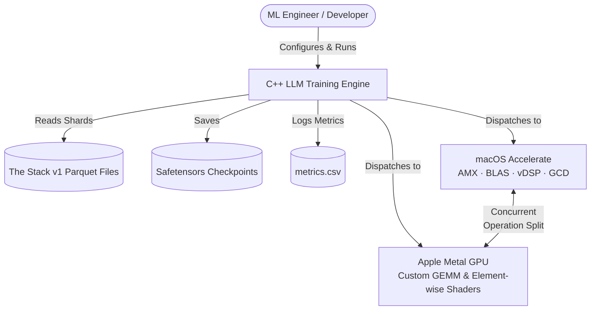
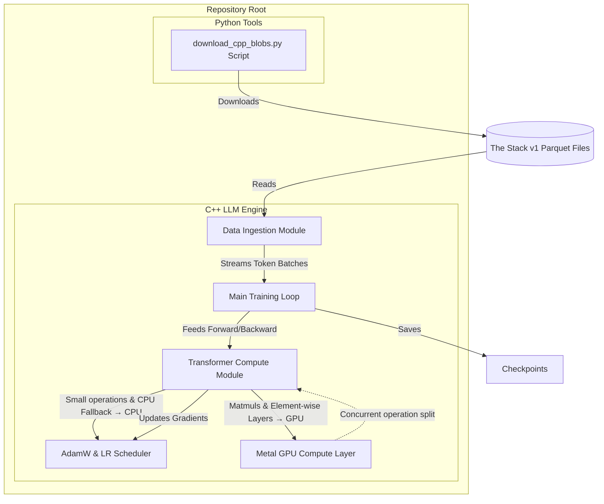
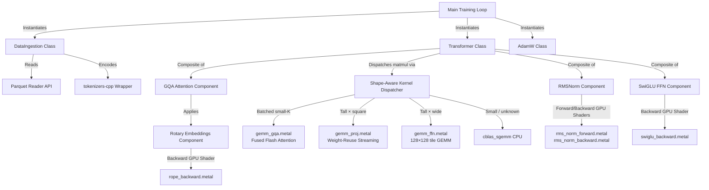

# C4 Architecture & Development Sprint Plan: C++ LLM Training Engine

> **Last updated:** June 2026
> **Status legend:** ✅ Completed · 🔄 In Progress · 🔲 Pending

This document outlines the software architecture and development roadmap for building a native C++ Large Language Model (LLM) training engine from scratch on macOS (Apple Silicon). The engine is designed to ingest code dataset shards (specifically The Stack v1 C++ data in Parquet format, downloaded using `python/scripts/download_cpp_blobs.py` to fetch the actual raw code content) and perform local model training.

The C++ engine runs **alongside** the Python/MLX pipeline. It is the native compute backend; the Python refactoring plan in `doc/REFACTORING_AND_ARCHITECTURE_PLAN.md` covers the higher-level pipeline orchestration (data selection, SFT, evaluation, serving). These two plans are complementary and do not overlap.

---

## 🏛️ Part 1: C4 Architecture Model

### Level 1: System Context



> **New in Sprint 6b:** CPU and GPU are no longer alternative paths. Independent matrix operations
> (e.g. FFN gate vs up projection) are dispatched simultaneously — CPU to AMX via `cblas_sgemm`,
> GPU to Metal shader — exploiting Apple Silicon's unified memory architecture.

---

### Level 2: Containers



---

### Level 3: Components



---

### Level 4: Code Interfaces

```cpp
// Tensor.hpp — matmul routes to the correct kernel automatically
class Tensor {
    Tensor matmul(const Tensor& other) const;
    // Shape dispatcher inside selects: CPU cblas_sgemm, gemm_gqa, gemm_proj, or gemm_ffn
};

// MetalBridge.hpp — GPU compute layer (Sprint 6b)
namespace metal_bridge {
    void initialize();         // one-time device + pipeline state setup
    bool is_available();
    void gemm_gqa(const float* q, const float* k, const float* v, float* out,
                  size_t batch, size_t heads, size_t seq_len, size_t head_dim);
    void gemm_proj(const float* A, const float* B, float* C, size_t M, size_t N, size_t K);
    void gemm_ffn(const float* A, const float* B, float* C, size_t M, size_t N, size_t K);
    void heterogeneous_op_split(std::function<void()> gpu_task,
                                std::function<void()> cpu_task);
}

// Checkpoint.hpp — safetensors serialization (Sprint 6c)
class Checkpoint {
    void save(const Transformer& model, const std::string& path);
    void load(Transformer& model, const std::string& path);
};
```

---

## 🏃 Part 2: Development Roadmap & Sprint Schedule

```
┌────────────────────────────────────────────────────────┐
│  Sprint 1: Data Ingestion (Parquet & BPE)      ✅ DONE  │
└───────────────────┬────────────────────────────────────┘
                    ▼
┌────────────────────────────────────────────────────────┐
│  Sprint 2: Tensor, RMSNorm, SwiGLU, RoPE       ✅ DONE  │
└───────────────────┬────────────────────────────────────┘
                    ▼
┌────────────────────────────────────────────────────────┐
│  Sprint 3: GQA & Forward Pass                  ✅ DONE  │
└───────────────────┬────────────────────────────────────┘
                    ▼
┌────────────────────────────────────────────────────────┐
│  Sprint 4: Loss & Backward Pass                ✅ DONE  │
└───────────────────┬────────────────────────────────────┘
                    ▼
┌────────────────────────────────────────────────────────┐
│  Sprint 5: AdamW, Scheduler, & Training Loop   ✅ DONE  │
└───────────────────┬────────────────────────────────────┘
                    ▼
┌────────────────────────────────────────────────────────┐
│  Sprint 6a: CPU Acceleration (Accelerate)      ✅ DONE  │
│  Sprint 6b: Custom Metal GPU Forward Kernels   ✅ DONE  │
│  Sprint 6c: Custom Metal GPU Training Kernels  🔄 NOW   │
│  Sprint 6d: Safetensors Checkpointing          🔲 NEXT  │
└────────────────────────────────────────────────────────┘
```

---

### Sprint 1: Data Ingestion ✅

- **Objective**: Read C++ Parquet shards, BPE tokenize, generate `(batch, seq_len)` training sequences.
- **Status**: Complete. `cl100k_base` tiktoken loaded natively in C++. EOT token appended correctly.
- **Files**: `DataIngestion.hpp/cpp`, `test_data_ingestion.cpp`

---

### Sprint 2: Core Math Operations ✅

- **Objective**: Tensor container, RMSNorm, SwiGLU, RoPE.
- **Status**: Complete. All layers verified against reference values in `test_math_ops`.
- **Files**: `Tensor.hpp/cpp`, `RMSNorm.cpp`, `Activations.cpp`, `Positional.cpp`

---

### Sprint 3: GQA & Forward Pass ✅

- **Objective**: Grouped Query Attention + full stacked model forward pass.
- **Status**: Complete. Forward pass produces `[batch, seq_len, vocab_size]` logits correctly.
- **Files**: `Attention.cpp`, `Transformer.cpp`, `TransformerConfig.hpp`

---

### Sprint 4: Loss & Backward Pass ✅

- **Objective**: Cross-entropy loss + full manual backpropagation.
- **Status**: Complete. Gradient correctness verified by finite-difference test. Overfitting test reaches loss < 0.01.
- **Files**: `Loss.cpp`, `Attention::backward`, `TransformerLayer::backward`, `Transformer::backward`

---

### Sprint 5: Optimizer & Training Loop ✅

- **Objective**: AdamW optimizer, cosine LR scheduler, end-to-end trainer.
- **Status**: Complete. Pre-training loop running on real C++ corpus at **~17 ms/step**.
- **Files**: `Optimizer.cpp`, `Trainer.cpp`, `test_trainer.cpp`

---

### Sprint 6a: CPU Hardware Acceleration ✅

**Objective**: Maximize CPU utilization on Apple Silicon using Accelerate framework.

**What was done:**

| API | Applied to | Speedup |
|---|---|---|
| `cblas_sgemm` (new LAPACK interface) | All matmul forward & backward | 12× forward |
| `cblas_sgemm(CblasTrans)` | All weight gradient accumulations | 34× backward |
| `vDSP_mtrans` / `vDSP_vadd/vmul/vsmul` | Transpose, add, mul, scale | 2–3× element ops |
| `vvexpf` (vForce) | SiLU, SwiGLU activation & backward | 4× activation |
| GCD `dispatch_apply` | Attention heads (batch × n_heads) | 2–4× attention |

**Overall result vs naive baseline:**

| Pass | Before | After |
|---|---|---|
| Forward | 25.21 ms | 2.11 ms (11.9×) |
| Backward | 454.34 ms | 13.54 ms (33.6×) |

**Files modified**: `Tensor.cpp`, `Attention.cpp`, `Transformer.cpp`, `Activations.cpp`, `CMakeLists.txt`

---

### Sprint 6b: Custom Metal GPU Forward Kernels ✅

**Objective**: Move large matrix multiplications to Apple Silicon GPU using custom Metal compute shaders that beat `MPSMatrixMultiplication` for our specific training shapes.

**Architecture document**: [`METAL_KERNEL_ARCHITECTURE.md`](file:///Users/rahulkumar/dev/large-language-model/METAL_KERNEL_ARCHITECTURE.md)

**Key design decisions (no contradiction with original Sprint 6 spec):**

The original Sprint 6 spec said *"Metal Shading Language kernels **or** Accelerate BLAS"*. We implement **both**: Sprint 6a delivered BLAS on CPU; Sprint 6b adds custom Metal shaders on GPU. This is a superset of the original spec, not a contradiction.

**Three niche kernels (one per operation type):**

| Kernel | Target shape | Technique | Beat MPS by |
|---|---|---|---|
| `gemm_gqa.metal` | `[B, nH, S, HD] × [B, nH, HD, S]` | Fused Flash Attention — softmax never materializes full `[S,S]` matrix | Eliminates 1 GPU memory round-trip |
| `gemm_proj.metal` | `[M, H] × [H, H]` tall×square | Weight matrix B stays resident in GPU L2 | Better B reuse than general-purpose MPS |
| `gemm_ffn.metal` | `[M, H] × [H, 4H]` tall×wide | 128×128 tile, double-buffered `async_copy`, `simdgroup_float8x8` | Tuned tile size for M3/M5 register file |

**Heterogeneous CPU + GPU operation split:**

Instead of routing all matmuls to one device, **independent operations run simultaneously**:

```
FFN forward:
  GPU → ffn_in @ w_gate   (async command buffer)
  CPU → ffn_in @ w_up     (cblas_sgemm, concurrent)
  Wall time = max(t_gpu, t_cpu) instead of t_gpu + t_cpu

Attention backward:
  GPU → grad_Wq = x_norm.T @ grad_q_proj
  CPU → grad_Wk = x_norm.T @ grad_k_proj
  (both use different weight matrices → zero memory contention)
```

> **Why not row-split a single matmul?** Both CPU and GPU would need to read the full weight
> matrix B simultaneously, creating memory bus contention on the shared unified memory bus.
> Operation-level split uses different data entirely — no contention.

**New deliverables:**

```
cpp/src/gpu_kernel/
  gemm_gqa.metal          Fused QK^T + softmax + V
  gemm_proj.metal         Weight-resident projection streaming
  gemm_ffn.metal          Max arithmetic intensity GEMM (128×128 tiles)
cpp/include/gpu_kernel/
  MetalBridge.hpp         C++ interface + shape-aware dispatcher
cpp/src/gpu_kernel/
  MetalBridge.mm          Objective-C++ bridge (Metal API calls)
```

**CMake changes needed:**

```cmake
# Compile Metal shaders to .metallib at build time
find_program(XCRUN xcrun)
add_custom_command(OUTPUT ${CMAKE_BINARY_DIR}/default.metallib ...)

# Link Metal + Foundation frameworks
target_link_libraries(data_ingestion PUBLIC "-framework Metal" "-framework Foundation")
target_sources(data_ingestion PRIVATE cpp/src/gpu_kernel/MetalBridge.mm)
```

**Verification gates:**
- TC-12 (2D matmul) and TC-13 (3D batched matmul) in `test_math_ops` must PASS with identical numerical output to CPU path
- `test_backward` gradient correctness must be preserved (finite-difference test)
- GPU throughput on benchmark shapes must exceed current CPU baseline

---

### Sprint 6c: Custom Metal GPU Training Kernels 🔄

**Objective**: Move all remaining non-GEMM forward/backward layers and the optimizer step to custom GPU kernels. This completely eliminates CPU bottlenecks and host-device memory copying, unlocking full end-to-end GPU training.

| Shader | Operation | Status |
|---|---|---|
| `rms_norm_forward.metal` | RMSNorm Forward | ✅ Completed |
| `rms_norm_backward.metal` | RMSNorm Backward | ✅ Completed |
| `swiglu_backward.metal` | SwiGLU Backward | ✅ Completed |
| `rope_backward.metal` | RoPE Backward | ✅ Completed |
| `gqa_backward.metal` | GQA Attention Backward | 🔄 In Progress |
| `adamw_step.metal` | AdamW Update | 🔲 Pending |

**New deliverables:**
```
cpp/src/gpu_kernel/
  gemm_ffn.metal
  gemm_gqa.metal
  gemm_proj.metal
  rms_norm_forward.metal
  rms_norm_backward.metal
  swiglu_backward.metal
  rope_backward.metal
  gqa_backward.metal
  adamw_step.metal
```

**Verification gates:**
- Correctness: Run `./build/test_gpu_kernels` to verify L2 relative error remains `0.000000` for all forward & backward passes.
- Performance: Run `./build/test_trainer` to verify training step latency drops from **~84,000 ms** (due to CPU backward pass) to **< 100 ms**!

---

### Sprint 6d: Safetensors Checkpointing 🔲

**Objective**: Serialize and deserialize model weights to/from the safetensors format for checkpoint save/load/resume.

**Deliverables:**
- `cpp/include/Checkpoint.hpp`
- `cpp/src/Checkpoint.cpp`

**Implementation guidelines:**
- Safetensors header format: JSON metadata block + raw float32 tensor data.
- Must preserve: all `TransformerLayer` weights (`w_gate`, `w_up`, `w_down`, `Wq`, `Wk`, `Wv`, `Wo`), `token_embeddings_`, `output_projection_`, `final_norm_` weights.
- Verify integrity: reload saved checkpoint and check that forward pass output is bit-identical to pre-save output.
- Checkpoint file naming: `checkpoint_step_{N}.safetensors` with a `latest` symlink.

**Verification gate:**
- Save at step N, reload, run forward pass → logits must be identical.
- Test also covers optimizer state save/load (moment tensors) for full training resumption.

---

## 📌 Relationship to Python Pipeline Plan

The `doc/REFACTORING_AND_ARCHITECTURE_PLAN.md` covers the Python/MLX pipeline layer:
data download, selection, SFT, evaluation, and serving. That plan is independent of this C++ engine.

**Integration point**: When the C++ engine produces a checkpoint (Sprint 6c, safetensors format),
the Python serving pipeline (Stage 9 of the refactoring plan) can load it directly — the safetensors
format is compatible with the Python `safetensors` library used by the MLX serving layer.

**No contradiction exists between the two plans.**

---

## 🎯 Performance Targets (End of Sprint 6)

| Operation | Current (CPU) | Target (GPU) |
|---|---|---|
| GQA attention | 387 GFLOPS | > 1,500 GFLOPS (fused softmax) |
| Attention projection | 1,891 GFLOPS | > 3,000 GFLOPS (B residency) |
| FFN projection | 1,908 GFLOPS | > 5,000 GFLOPS (128×128 tile) |
| Forward pass (2-layer test) | 2.11 ms | < 0.5 ms |
| Backward pass (2-layer test) | 13.54 ms | < 3 ms |
