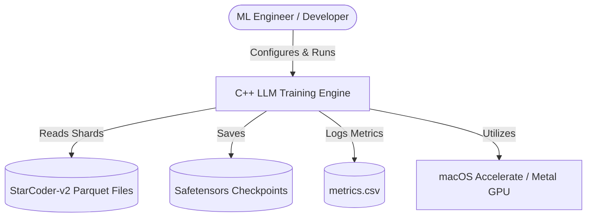
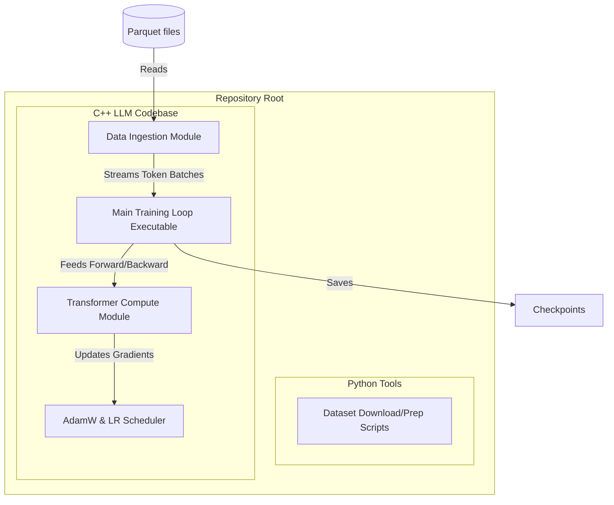
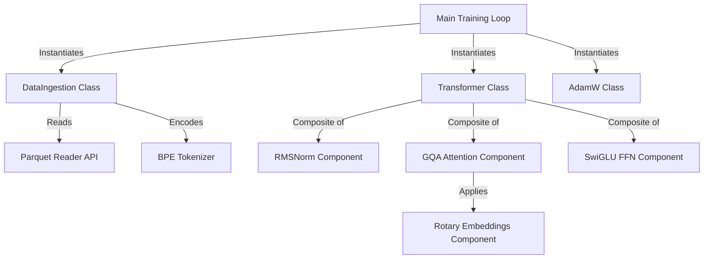

# C4 Architecture & Development Sprint Plan: C++ LLM Training Engine

This document outlines the software architecture and development roadmap for building a native C++ Large Language Model (LLM) training engine from scratch on macOS (Apple Silicon). The engine is designed to ingest code dataset shards (specifically StarCoder-v2 C++ data in Parquet format) and perform local model training.

---

## 🏛️ Part 1: C4 Architecture Model

### Level 1: System Context
The system context defines the training engine boundaries, data dependencies, and hardware integrations.



---

### Level 2: Containers
Breaks the repository codebase down into high-level build targets and namespaces.



---

### Level 3: Components
Identifies the key classes and structural modules inside the C++ engine.



---

### Level 4: Code (Header Blueprints)
Declares the base class structures and programmatic interfaces.

```cpp
// DataIngestion.hpp
class DataIngestion {
public:
    DataIngestion(const std::string& data_dir, const std::string& vocab_path);
    bool load_shard(const std::string& shard_name);
    std::pair<std::vector<int>, std::vector<int>> get_next_batch(int batch_size, int block_size);
};

// Transformer.hpp
class Transformer {
public:
    Transformer(const ModelConfig& config);
    Tensor forward(const Tensor& input_ids);
    Tensor backward(const Tensor& loss_gradients);
};
```

---

## 🏃 Part 2: Development Roadmap & Sprint Schedule

The codebase development is structured into **6 execution sprints**. Each sprint delivers a complete, testable module accompanied by a functional verification unit test.

```
┌────────────────────────────────────────────────────────┐
│  Sprint 1: Data Ingestion (Parquet & BPE)              │
└───────────────────┬────────────────────────────────────┘
                    ▼
┌────────────────────────────────────────────────────────┐
│  Sprint 2: Tensor Operations, RMSNorm, SwiGLU, & RoPE  │
└───────────────────┬────────────────────────────────────┘
                    ▼
┌────────────────────────────────────────────────────────┐
│  Sprint 3: GQA & Forward Pass                          │
└───────────────────┬────────────────────────────────────┘
                    ▼
┌────────────────────────────────────────────────────────┐
│  Sprint 4: Loss & Backward Pass                        │
└───────────────────┬────────────────────────────────────┘
                    ▼
┌────────────────────────────────────────────────────────┐
│  Sprint 5: AdamW, Scheduler, & Full Training Loop     │
└───────────────────┬────────────────────────────────────┘
                    ▼
┌────────────────────────────────────────────────────────┐
│  Sprint 6: Checkpointing & Hardware Optimization (MPS) │
└────────────────────────────────────────────────────────┘
```

---

### Sprint 1: Data Ingestion (`DataIngestion`)
* **Objective**: Read local C++ dataset Parquet files, extract text columns, apply Byte-Pair Encoding (BPE) tokenization, and generate training sequences of shape `(batch_size, block_size)`.
* **Deliverables**:
  * `cpp/include/DataIngestion.hpp`
  * `cpp/src/DataIngestion.cpp`
  * `cpp/tests/test_data_ingestion.cpp` (Validation driver executable)
* **Implementation Guidelines**:
  * Utilize the Apache Arrow/Parquet C++ APIs (or a lightweight custom reader) to read binary Parquet shards without full memory loading.
  * Implement BPE vocabulary lookup to convert raw source code characters into integer token arrays.
  * Formulate sequential training matrices $X$ and shifted targets $Y$ where $Y_{i} = X_{i+1}$.

---

### Sprint 2: Core Math Operations (`Tensor`, `RMSNorm`, `SwiGLU`, & `RoPE`)
* **Objective**: Implement a lightweight multidimensional Tensor container and the mathematical layer kernels.
* **Deliverables**:
  * `cpp/include/Tensor.hpp` (Handles shape, strides, dynamic memory allocations, and element-wise math)
  * `cpp/src/RMSNorm.cpp` (Root Mean Square Normalization logic)
  * `cpp/src/Activations.cpp` (SwiGLU activation projection)
  * `cpp/src/Positional.cpp` (Rotary Positional Embeddings - RoPE complex-space rotation)
* **Implementation Guidelines**:
  * Write the matrix math manually to avoid framework coupling.
  * Implement element-wise operations with memory-mapped layouts to support fast array manipulation.
  * Validate mathematical layer outputs against reference arrays to verify correctness.

---

### Sprint 3: Grouped Query Attention (GQA) & Model Forward Pass
* **Objective**: Assemble attention projections and stack layers to execute a full model forward pass.
* **Deliverables**:
  * `cpp/src/Attention.cpp` (Grouped Query Attention mapping query heads to grouped key/value head pairs)
  * `cpp/src/Transformer.cpp` (Assembling 24 stacked layers combining RMSNorm, Attention, and SwiGLU FFN)
* **Implementation Guidelines**:
  * Implement weight matrices for Q, K, V projections and final projection layers.
  * Execute cached attention calculation keys/values for decoding logic.
  * Verify that a forward pass of token ID arrays produces logits of shape `(batch_size, block_size, vocab_size)`.

---

### Sprint 4: Backward Pass & Gradient Tracking
* **Objective**: Define loss calculation and implement manual backpropagation for gradient tracking.
* **Deliverables**:
  * `cpp/src/Loss.cpp` (Cross-entropy loss calculation and its analytical gradient)
  * Backward functions inside active layers (`RMSNorm::backward`, `Attention::backward`, `SwiGLU::backward`)
* **Implementation Guidelines**:
  * Write the derivative implementations for cross-entropy calculations.
  * Track gradients layer-by-layer back to embedding matrices.
  * Verify gradient computations using overfitting tests on small single-sentence targets.

---

### Sprint 5: Optimizer & Core Training Loop
* **Objective**: Write parameter update formulas and orchestrate the full training execution.
* **Deliverables**:
  * `cpp/src/Optimizer.cpp` (AdamW optimizer updates including weight decay)
  * `cpp/src/Scheduler.cpp` (Linear learning rate warmup + cosine decay scheduler)
  * `cpp/src/main.cpp` (Core training entry point coordinating batches, model passes, optimization steps, and metric logs)
* **Implementation Guidelines**:
  * Implement standard AdamW updating logic tracking first and second moments.
  * Output loss, learning rate, and token throughput statistics dynamically to console and CSV metrics files.

---

### Sprint 6: Hardware Optimization & Checkpointing
* **Objective**: Integrate hardware vector math acceleration and checkpoint serialization.
* **Deliverables**:
  * `cpp/src/MatrixMul.cpp` (Metal Shading Language kernels or Accelerate BLAS matrix multiplications)
  * `cpp/src/Checkpoint.cpp` (Safetensors loader/saver serialization library)
* **Implementation Guidelines**:
  * Bind matrix multiplications to macOS standard BLAS APIs (`cblas_sgemm` from Accelerate Framework) or write Custom GPU Metal Shaders.
  * Verify checkpoint loading integrity by checking that outputs are identical before and after saving/loading.
