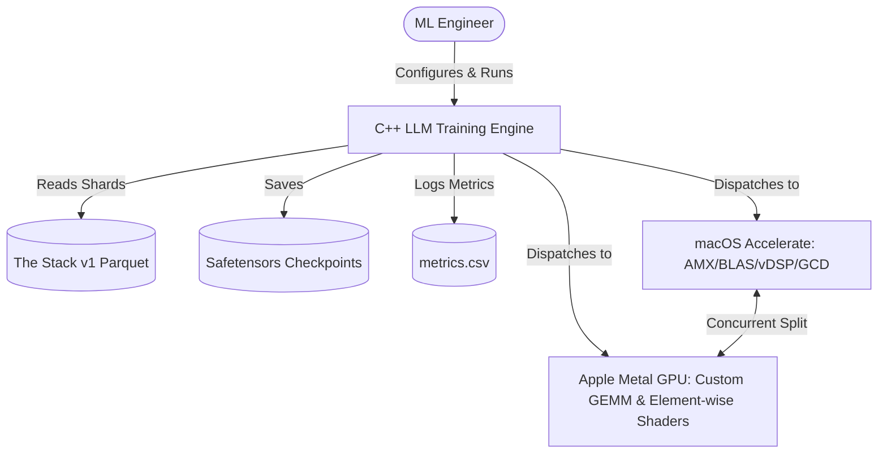
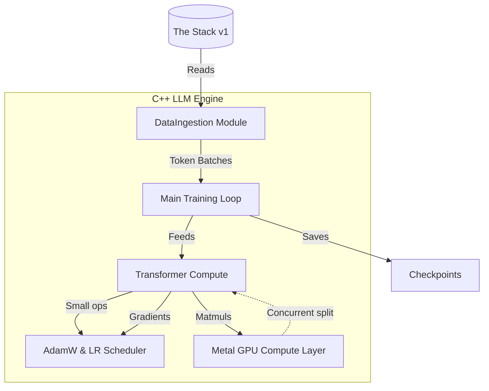
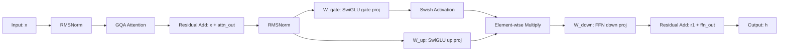

# System Architecture

The engine is a **native C++20** training backend for 1.6B-parameter GPT-style language models, optimized for Apple Silicon's unified memory architecture (UMA).

## System Context



Key insight: CPU and GPU are **not alternative paths** on Apple Silicon. Independent matrix operations (e.g., FFN gate vs up projection) are dispatched simultaneously — CPU to AMX via `cblas_sgemm`, GPU to Metal shader — exploiting UMA.

## Component Containers



## Layer Architecture (Transformer Block)



This architecture matches LLaMA-2/Mistral patterns: **Grouped Query Attention** (16 Q heads, 8 KV heads) + **SwiGLU FFN** + **Pre-norm RMSNorm** + **RoPE** applied to Q and K.

## Hybrid CPU/GPU Compute Model

The [`MetalBridge.mm`](../cpp/src/gpu_kernel/MetalBridge.mm) implements a **heterogeneous dispatch strategy**:

1. **GPU-first kernels**: Large GEMM operations (projection, FFN gate/up) → custom Metal shaders with 64×64 threadgroup tiling
2. **CPU fallback**: Small or irregularly-shaped matmuls → `cblas_sgemm` via Accelerate
3. **Concurrent splits**: Independent paired matmuls (gate + up projection) dispatched to GPU + CPU simultaneously
4. **Buffer caching**: Raw host pointers mapped to `MTLBuffer` objects via an LRU-like cache; weight tensors marked persistent to avoid re-upload

See [GPU Metal Kernels](../domain/gpu-kernels.md) for kernel-level details and [METAL_KERNEL_ARCHITECTURE.md](../cpp/doc/METAL_KERNEL_ARCHITECTURE.md) for the original design rationale.

## Data Flow (Training Step)

```
Pretokenized .bin file
    → DataIngestion::get_batch() → [batch_size, seq_len] token IDs
    → Transformer::forward() → [batch_size, seq_len, vocab_size] logits
    → CrossEntropyLoss::forward() → scalar loss
    → CrossEntropyLoss::backward() → grad_logits
    → Transformer::backward() → gradients for all parameters
    → AdamWOptimizer::step(lr) → parameter updates
    → (repeat)
```

## Key Design Decisions

| Decision | Rationale |
|---|---|
| **C++20, -O3** | Maximum CPU performance for a GPU-accelerated workload |
| **Float32 precision** | Simpler debugging; baseline Python/MLX uses bfloat16 |
| **Safetensors checkpoints** | Direct compatibility with Python/MLX for eval and inference |
| **Pretokenized .bin files** | Single-pass tokenization at startup; avoids hot-path text encoding |
| **Flat weight layout** | No dynamic shapes during training means fixed buffer sizes and no reallocation |
| **Persistent MTLBuffer cache** | Weight tensors (projection matrices, norms) reuse the same GPU buffer across all training steps |

## Source Files

| File | Role |
|---|---|
| `CMakeLists.txt` | Build system, test targets, Metal kernel compilation |
| `cpp/include/Transformer.hpp` | Transformer model declaration |
| `cpp/src/gpu_kernel/MetalBridge.mm` | Metal runtime bridge and CPU/GPU dispatch |
| `cpp/src/Trainer.cpp` | Training loop orchestrator |
| `cpp/src/RunTrainer.cpp` | CLI entry point with config parsing |
| `cpp/doc/METAL_KERNEL_ARCHITECTURE.md` | Design document for GPU kernel architecture |
| `cpp/doc/architecture.md` | Original MLX-era architecture (partially outdated) |
