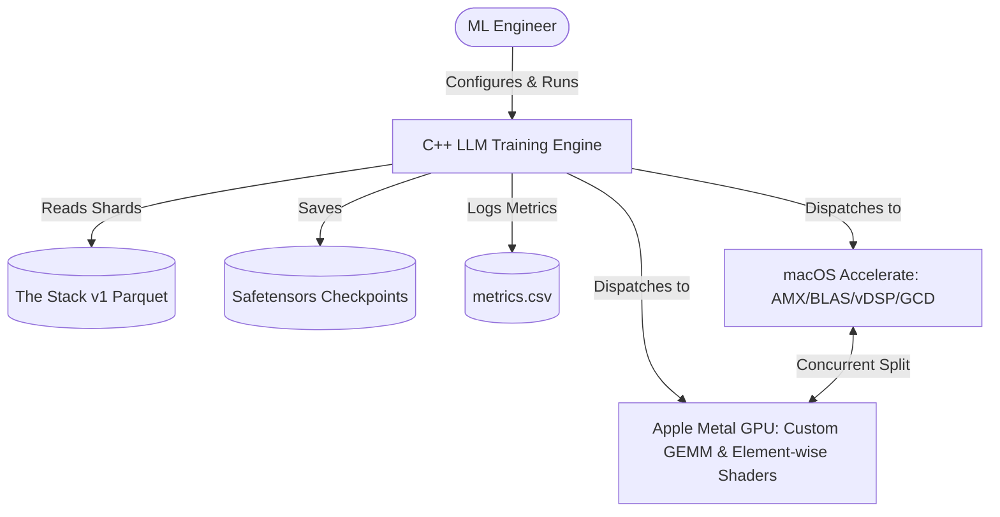
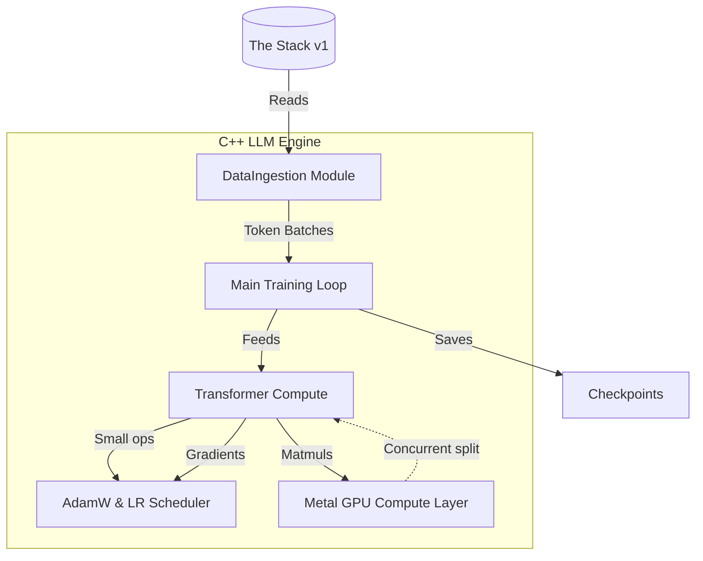

# System Architecture

The engine is a **native C++20** training backend for a 1.6B-parameter GPT-style language model, optimized for Apple Silicon's unified memory architecture (UMA).

## System Context



**Key insight**: CPU and GPU are **not alternative paths** on Apple Silicon. Independent matrix operations (e.g., FFN gate vs up projection) are dispatched simultaneously — CPU via `cblas_sgemm` (AMX), GPU via Metal shaders — exploiting UMA without data copy overhead.

## Component Architecture



## Hybrid CPU/GPU Compute Model

Implemented in [`MetalBridge.mm`](/cpp/src/gpu_kernel/MetalBridge.mm), the engine uses a **heterogeneous dispatch strategy**:

1. **GPU-first kernels**: Large GEMM operations (projection, FFN gate/up) → custom Metal shaders with 64x64 threadgroup tiling
2. **CPU fallback**: Small or irregularly-shaped matmuls → `cblas_sgemm` via Accelerate
3. **Concurrent splits**: Independent paired matmuls (gate + up projection) dispatched to GPU + CPU simultaneously
4. **Buffer caching**: Raw host pointers mapped to `MTLBuffer` via LRU-like cache; weight tensors marked persistent

See [GPU Metal Kernels](/domain/gpu-kernels.md) for kernel-level details and the authoritative [Architecture Overview](/architecture/overview.md) for Mermaid diagrams of the transformer block and data flow.

## Data Flow (Training Step)

```
Pretokenized .bin file
    → DataIngestion::get_batch() → [batch_size, seq_len] token IDs
    → Transformer::forward() → [batch_size, seq_len, vocab_size] logits
    → CrossEntropyLoss::forward() → scalar loss
    → CrossEntropyLoss::backward() → grad_logits
    → Transformer::backward() → gradients for all parameters
    → AdamWOptimizer::step(lr) → parameter updates
    → (repeat)
```

## Key Design Decisions

| Decision | Rationale |
|---|---|
| **C++20, -O3** | Maximum CPU performance for GPU-accelerated workload |
| **Float32 precision** | Simpler debugging; baseline Python/MLX uses bfloat16 |
| **Safetensors checkpoints** | Direct compatibility with Python/MLX for eval and inference |
| **Pretokenized .bin files** | Single-pass tokenization at startup; avoids hot-path text encoding |

## Source Files

- `cpp/include/TransformerConfig.hpp` — Model hyperparameters
- `cpp/include/Transformer.hpp` — Model class declaration
- `cpp/include/Trainer.hpp` — Trainer loop declaration
- `cpp/src/gpu_kernel/MetalBridge.mm` — GPU bridge implementation
- `cpp/src/Trainer.cpp` — Training loop implementation

For the complete architecture including the layer-by-layer transformer block, see the [root Architecture Overview](/architecture/overview.md).
